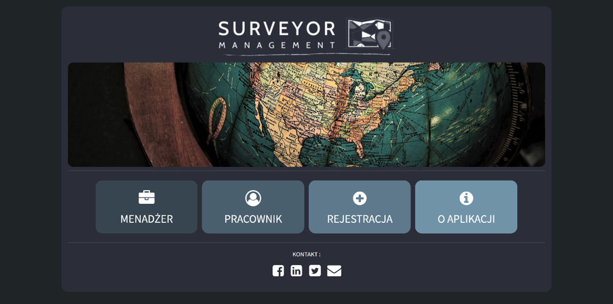
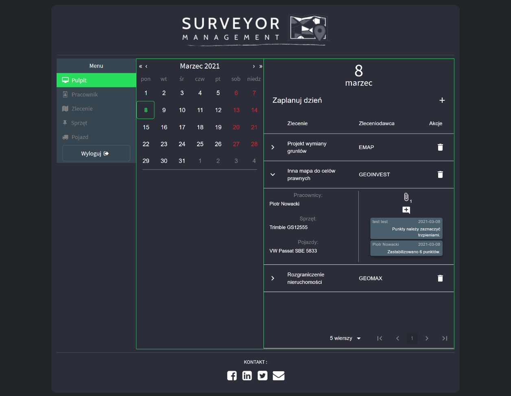
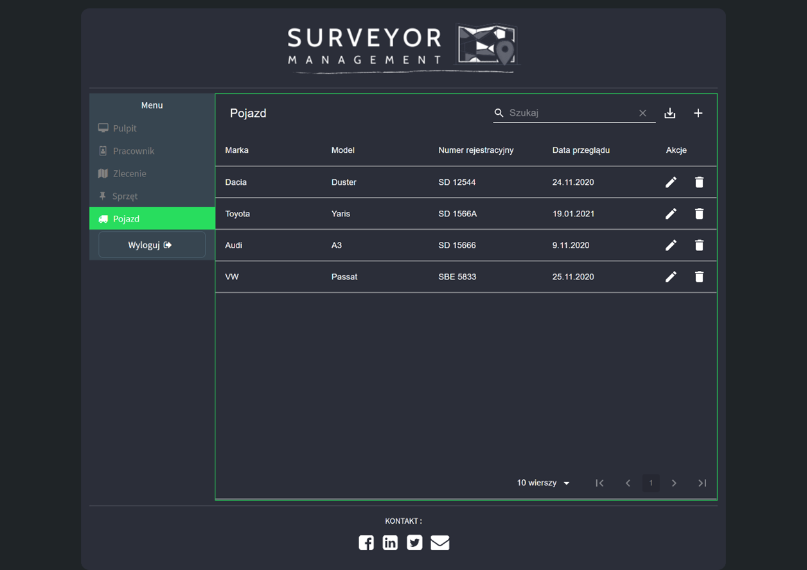
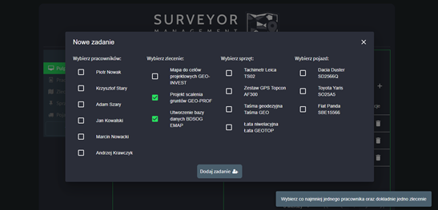
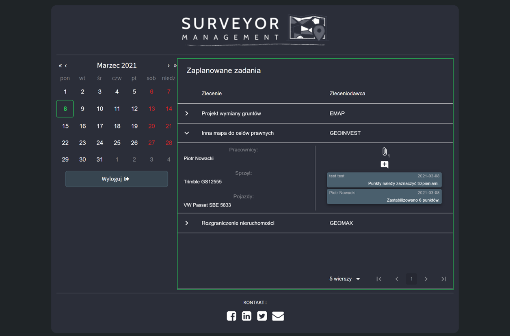

# surveyor-management-ui

1. [Project description](#description)
2. [Technologies](#technologies)
3. [Screenshots](#screenshots)

## Project description 
SurveyorManagement is a web application that can help to manage geodesic company.
User can:
- add data about employees, cars, orders and equipment
- manage work schedule
- share files
- chat with other users
- create user accounts for employees

## Technologies 
Application was created using:
- JavaScript
- React.js
- MaterialUI
- React Hook Form
- material-table
- and others...
## Screenshots 

